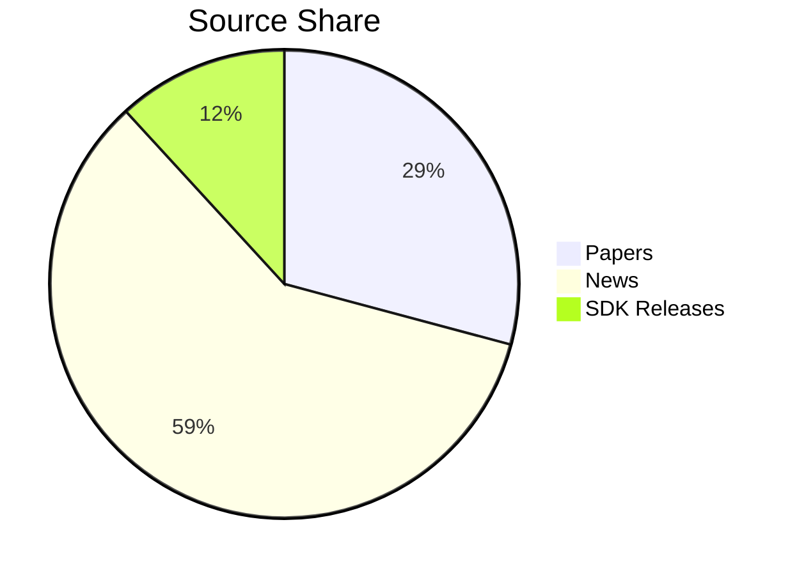
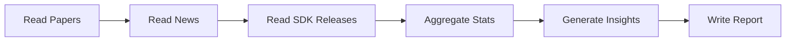

## Context
本变更跨 `get_paper`、`get_agent_news`、`get_sdk_release_change_log` 三个子工程的导出产物进行只读聚合，生成中文 Markdown 深度分析报告。各子工程已具备按区间导出与统计能力，编排器无需重复抓取。

## Goals / Non-Goals
- Goals
  - 统一时间区间的只读聚合
  - 一键生成中文深度报告与 Mermaid 可视化
  - LLM 可选，缺失时模板化降级
- Non-Goals
  - 不改动子工程导出格式与代码路径
  - 不引入内置调度器（外部 CI/计划任务负责）

## Grounding（现有产出与目录约定）
- get_paper
  - 目录根：`get_paper/data/`
  - 区间标签：`YYYYMMDD-YYYYMMDD`（或 `YYYY-MM` 月标签）
  - 输出目录：`get_paper/data/exports/<label>/`
  - 已有文件（示例，来自 `src/monthly_run.py` 与 `agents_papers/utils/dates.py`）：
    - `<label>-stats.json`
    - `<label>-top10.json`
    - `<label>-ranked-all.json`
    - `<label>-ranked-rest.json`
    - `<label>-stats-cn.md`
    - `<label>-comprehensive-report.md`
- get_agent_news
  - 结构化导出根：`get_agent_news/data/exports/`
  - 单次运行目录：`<YYYYMMDD_HHMMSS>/`
  - 文件（来自 `src/storage/file_storage.py` 与 `src/main.py`）：
    - `news.jsonl`、`news.csv`
    - `news_ranked.jsonl`、`news_ranked.csv`（当存在分数）
    - `markdown/`（内含日期分层的 Markdown）
    - `analysis.json`、`TOP.md`（由 `write_analysis_files` 写入）
    - `README.txt`
  - 独立内容根（可选，纯内容发布用）：`get_agent_news/content/`
    - `daily/`、`news/`、`index.md`
- get_sdk_release_change_log
  - 目录根（来自 `config.py` 与 `src/main.py`）：`data/releases/`、`data/summaries/`
  - 文件：
    - Releases 页级 Markdown：`data/releases/<repo_slug>_<page>.md`
    - 摘要 Markdown（可选，提供 LLM 密钥时）：`data/summaries/<repo_slug>_<page>_summary.md`
  - 页内每条 Release 的 Markdown 段落包含：`Tag`、`Published At`、`URL` 与 `Notes`

以上路径均以各子项目目录为相对根；编排器应默认从 monorepo 根启动，并提供 CLI 允许覆盖这三个根目录。

## Decisions
- 目录约定：输出至 `reports/<YYYYMMDD-YYYYMMDD>/weekly-intel-report.md`，图表快照（若实现）至 `reports/<range>/assets/`
- 时间解析：`--start/--end` 或 `--last-days N`，缺省为最近 7 天
- 读取策略：优先读取区间匹配的导出目录；读取失败/缺失时以占位提示降级
- LLM 策略：`DEEPSEEK_API_KEY` 存在即启用深度分析；否则走模板化摘要
- Mermaid 约束：图内文本不含括号类符号，避免渲染异常；首选柱状/饼图/简单流程图
- 幂等策略：默认不覆盖已存在且非空的目标文件；提供 `--overwrite` 以便显式覆盖

## CLI 设计
- 命令：`uv run python -m report.main`
- 参数：
  - `--start YYYY-MM-DD` 与 `--end YYYY-MM-DD`（互斥于 `--last-days`）
  - `--last-days N`（默认 7）
  - `--paper-root PATH`（默认 `get_paper/data`）
  - `--news-root PATH`（默认 `get_agent_news/data/exports` 与 `get_agent_news/content`）
  - `--sdk-root PATH`（默认 `get_sdk_release_change_log/data`）
  - `--repos langchain-ai/langchain,openai/openai-python,...`（可选，筛选目标仓库）
  - `--output-root PATH`（默认 `reports`）
  - `--overwrite`（默认否）
  - `--log-level INFO|DEBUG`

## 聚合流程（Orchestration）
1) 解析时间范围
   - 若未提供参数，取最近 7 天：`today-6 .. today`，生成标签 `<YYYYMMDD-YYYYMMDD>`
2) 读取论文（get_paper）
   - 期望目录：`<paper-root>/exports/<label>/`
   - 存在则读取以下文件（若缺失则跳过对应分析分支）：
     - `*-stats.json`、`*-top10.json`、`*-ranked-*.json`、`*-comprehensive-report.md`
   - 输出标准化结构：`PaperItem{ title, authors, source, published_at?, tags, score?, rank? }`
3) 读取新闻（get_agent_news）
   - 遍历 `<news-root>` 下所有运行目录 `<YYYYMMDD_HHMMSS>`
   - 加载 `news.jsonl`，对每条记录按 `published_at`（若无则 `fetched_at`）进行区间过滤
   - 输出标准化结构：`NewsItem{ title, url, published_at?, fetched_at, source, source_type, tags, score? }`
4) 读取 SDK Releases（get_sdk_release_change_log）
   - 遍历 `data/releases/*.md`，按文件名推断 repo_slug，按内容中 `- **Published At**:` 解析时间并进行区间过滤
   - 若存在 `data/summaries/<repo_slug>_*_summary.md`，并入 `highlights`
   - 输出标准化结构：`ReleaseItem{ repo, tag, name, published_at, url, highlights? }`
5) 统计与可视化
   - 总量与来源占比（论文/新闻/SDK）
   - 日级时间序列（按天计数）
   - Top 主题/标签（论文/新闻）
   - 活跃仓库 TopN（SDK）
6) 综合洞察
   - 无密钥：基于规则的模板化总结（见“LLM 提示词与降级”）
   - 有密钥：调用 LLM 生成深度分析（趋势、主题、交叉影响、建议）
7) 写入报告
   - `reports/<label>/weekly-intel-report.md`，幂等写入；必要时 `--overwrite`

## 数据契约（Normalized Schemas）
```text
PaperItem:
  title: str
  authors: list[str] | str
  source: "arxiv" | "openreview" | "unknown"
  published_at?: str (ISO)
  tags?: list[str]
  score?: float
  rank?: int

NewsItem:
  title: str
  url: str
  published_at?: str (ISO)
  fetched_at: str (ISO)
  source: str
  source_type: str
  tags?: list[str]
  score?: float

ReleaseItem:
  repo: str            # org/repo
  tag: str
  name: str
  url: str
  published_at: str    # ISO
  highlights?: list[str]
```

## Mermaid 可视化约束与示例
- 所有节点/图例文本必须移除括号类符号（小/中/大括号）；必要时替换为空格或短横线。
- 推荐图表：
  - 占比饼图（论文/新闻/SDK）
  - 日级柱状图（过去 N 天总量）
  - 编排流程图（从数据读取到报告导出）

示例（饼图，占比文本不含括号）：


示例（流程图，节点文本无括号）：


## LLM 提示词与降级策略
- 启用条件：`DEEPSEEK_API_KEY` 存在
- 提示词约束（中文）：
  - 角色：资深技术分析员
  - 输入：标准化后的 `PaperItem`、`NewsItem`、`ReleaseItem` 概要（限制条数，如各 50 条内）
  - 目标：生成“趋势洞察”“主题聚类”“重要变更影响”“对团队的建议”
  - 产出要求：
    - 全中文
    - 精炼要点，分点列出
    - 不输出任何包含括号类符号的 Mermaid 文本
    - 若数据源缺失，显式声明分析局限
- 无密钥降级：
  - 使用模板：对各类数据统计（总量、Top 标签/仓库、日级趋势）生成规则化中文总结
  - 在报告“综合洞察”部分声明：未启用 LLM，观点为模板化摘要

## 错误处理与容错
- 子源缺失：在对应板块显示“数据缺失”，不影响整体报告写出
- 时间解析失败：跳过该条并记录日志
- 文件缺失：跳过该分支分析，记录告警
- 幂等：已有非空报告，默认不覆盖；`--overwrite` 则覆盖

## Risks / Trade-offs
- 风险：某一数据源缺失导致洞察偏差 → 降级提示并在“综合洞察”中披露数据缺失
- 风险：Mermaid 渲染差异 → 提供纯文本统计作为兜底
- 取舍：不内置调度，降低耦合，交给外部系统触发

## Migration Plan
新增 CLI 与聚合逻辑，不涉及数据迁移；与子工程保持松耦合。

## Open Questions
- 综合评分/权重算法是否需要可配置策略？
- 图表类型是否需要导出 PNG 快照（需要额外依赖）？


